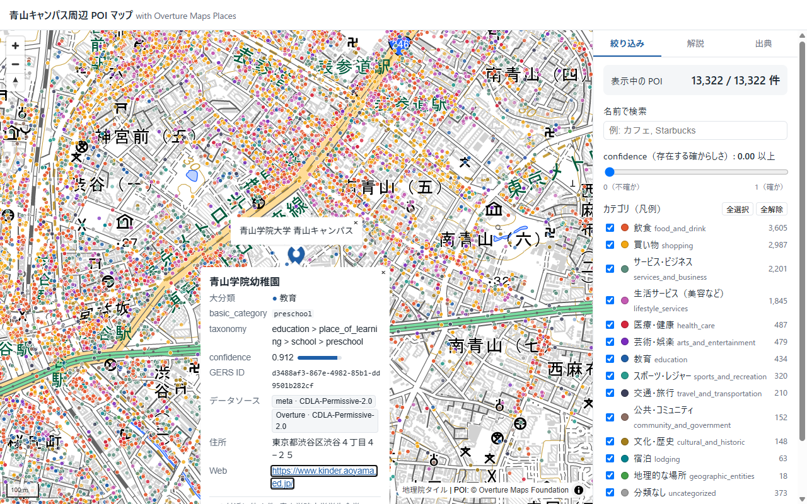
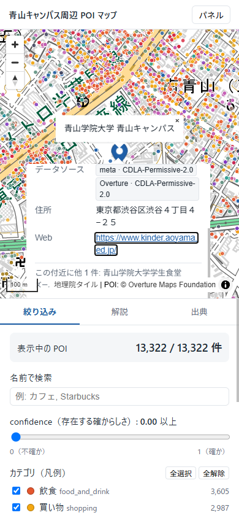

# 青山キャンパス周辺 POI マップ — Overture Maps Places を初めて触ってみた

Overture Maps の **Places** データを使って、青山学院大学 青山キャンパス周辺の POI（お店や施設などの地点）を
Web 地図で見られるようにした WebGIS です。

- **Web 地図（GitHub Pages）**: https://furuhashilab.github.io/Hackathon_Oct_KousakuNakagawa/
- **リポジトリ**: https://github.com/furuhashilab/Hackathon_Oct_KousakuNakagawa



<sub>スクリーンショット: 背景 地理院タイル（淡色地図）/ POI © Overture Maps Foundation</sub>

---

## ハッカソン概要

| 項目 | 内容 |
| --- | --- |
| イベント | 10月 FOSS4G Hiroshima / SotM Asia OSAKA 振り返りハッカソン |
| 形式 | ソロハッカソン |
| ルール | FOSS4G Hiroshima / SotM Asia OSAKA で紹介された「自分にとって新しい技術」を 1 つ使う |
| 選んだ技術 | **Overture Maps** |
| AI | Claude Code のみ使用 |
| 発表 | ブログ＋グラレコ、1 分（最大 3 分） |

## 制作者

Kousaku Nakagawa（FuruhashiLab）

## Overture Maps を選んだ理由

SotM Asia / FOSS4G で何度も名前を聞いたのに、自分では一度も触ったことがなかったからです。
「OpenStreetMap と何が違うの？」「企業のデータが混ざっているってどういうこと？」という疑問を、
実際のデータを手元に落として確かめてみたいと思いました。
身近な場所の方が「このデータは合ってる・おかしい」を判断しやすいので、対象は自分の大学の周りにしました。

## Overture Maps とは

[Overture Maps Foundation](https://overturemaps.org/) が公開している、世界規模のオープンな地図データです。
Amazon・Meta・Microsoft・TomTom などが参加していて、複数の会社や OpenStreetMap などのデータを
**共通の形式（スキーマ）にそろえて** 毎月リリースしています。

データは「テーマ」に分かれていて、今回使ったのは **places**（場所）テーマです。
ほかに buildings（建物）、transportation（道路など）、divisions（行政区画）、addresses（住所）、base（土地利用・水域など）があります。

データは GeoParquet という形式で AWS / Azure に置かれていて、必要な範囲だけを取り出して使います。

## 今回制作したもの

- 青山キャンパス周辺 約 2km 四方の Overture Places（**13,322 件**、リリース `2026-09-23.1`）を地図に表示
- POI をクリックすると、名前・カテゴリ・confidence・GERS ID・データソース（とそのライセンス）・住所などを表示
- カテゴリ（大分類 14 種）で絞り込み（凡例を兼ねたチェックボックス）
- confidence のスライダーで絞り込み（低いものほど点が薄く表示される）
- 名前での検索
- 表示中の POI 件数
- 取得範囲（bbox）を点線の四角で表示
- Overture Maps と用語の初心者向け解説、出典・ライセンスのタブ
- スマートフォン表示（地図が上、パネルが下。「パネル」ボタンで隠せる）

## スクリーンショット

| PC | スマートフォン |
| --- | --- |
|  |  |

画像は `docs/images/` に置いています。差し替える場合は同じファイル名で上書きしてください。

## 使用技術

| 技術 | 用途 |
| --- | --- |
| [Overture Maps](https://overturemaps.org/) Places | POI データ |
| [overturemaps-py](https://github.com/OvertureMaps/overturemaps-py) 1.0.2（公式 Python Client） | データ取得 |
| Python 3.12 / pyarrow | データ変換（GeoParquet → GeoJSON） |
| [MapLibre GL JS](https://maplibre.org/) 6.13.0 | Web 地図の表示 |
| [地理院タイル（淡色地図）](https://maps.gsi.go.jp/development/ichiran.html) | 背景地図（API キー不要） |
| GitHub Pages | 公開 |

ビルドツールやフレームワークは使わず、HTML / CSS / JavaScript だけで作っています。

## データ取得方法

```powershell
# 1. Python の仮想環境を作ってライブラリを入れる
python -m venv .venv
.venv\Scripts\python -m pip install -r requirements.txt

# 2. 取得・変換スクリプトを実行
.venv\Scripts\python scripts\fetch_places.py
```

`scripts/fetch_places.py` がやっていること:

1. 最新リリース（今回は `2026-09-23.1`）を調べる
2. bbox `139.6997, 35.6518, 139.7217, 35.6698` の範囲だけ、`place` タイプのデータを取得する（世界全体はダウンロードしない）
3. 点の座標（WKB 形式）を経度・緯度に変換する
4. Web 表示に必要な項目だけを残して `docs/data/aoyama_places.geojson` に保存する
5. 件数やデータソースの内訳を `docs/data/metadata.json` に保存する

> **メモ:** 本来は CLI の `overturemaps download --bbox=... -f geojson --type=place` 1 行で取得できます。
> ただ、手元の Windows では OS のセキュリティ機能（アプリ制御ポリシー）が shapely ライブラリの DLL をブロックして CLI が動きませんでした。
> そこで、pyarrow だけで動く同じパッケージの Python Client（`overturemaps.core.record_batch_reader`）を使っています。

キャンパスの位置（北緯 35.6606, 東経 139.7104）は OpenStreetMap の Nominatim で確認しました。

### 使っている Places の項目

2026 年 9 月リリースで旧 `categories` 項目は廃止されたので、新しい `basic_category` と `taxonomy` を使っています。

| Overture の項目 | GeoJSON での名前 | 内容 |
| --- | --- | --- |
| `id` | `id` | GERS ID |
| `names.primary` | `name` | 名前 |
| `names.rules`（language=en） | `name_en` | 英語名（あれば） |
| `basic_category` | `basic_category` | 分かりやすい大まかなカテゴリ |
| `taxonomy.primary` | `taxonomy_primary` | 一番細かいカテゴリ |
| `taxonomy.hierarchy` | `taxonomy_hierarchy`, `group` | カテゴリの階層（`group` は最上位） |
| `confidence` | `confidence` | 存在する確からしさ（0〜1） |
| `operating_status` | `operating_status` | 営業状況 |
| `addresses[0].freeform` | `address` | 住所 |
| `websites[0]` | `website` | Web サイト |
| `sources[].dataset / license` | `sources` | データの提供元とライセンス |

## 用語の説明

### POI とは

**Point of Interest** の略で、地図上の「気になる地点」のことです。
カフェ、コンビニ、病院、駅、大学など、人が訪れたり探したりする場所を点で表したものです。

### confidence とは

その場所が **本当に存在する確からしさ** を 0〜1 の数字で表したものです。1 に近いほど「実在する可能性が高い」とされます。
ただし「位置や名前が正確かどうか」の保証ではありません。
実際に見てみると、Foursquare 由来の POI は全部 0.77、meta 由来の POI は 0.01〜1.0 まで細かくばらついていて、
**データソースによって値の付き方がかなり違う** ことが分かりました。

### GERS ID とは

**Global Entity Reference System** の ID です。
Overture の地物ひとつひとつに振られた固有の番号（`d3488af3-867e-4982-85b1-dd9501b282cf` のような UUID）で、
毎月のリリースをまたいでも同じ場所は同じ ID のまま使えるようになっています。
自分のデータに GERS ID を付けておけば、Overture が更新されても ID で結び付け直せる、というのが狙いです。

### bbox とは

**Bounding Box** の略で、「西の経度・南の緯度・東の経度・北の緯度」の 4 つの数字で決める四角い範囲です。
Overture は世界中のデータなので、bbox で必要な範囲だけを取り出しました。地図上では点線の四角で表示しています。

### GeoJSON とは

位置情報（座標）と属性（名前やカテゴリなど）をまとめて保存できる、JSON 形式の地理データです。
テキストファイルなのでブラウザでそのまま読み込めて、Web 地図でよく使われます。

### MapLibre とは

**MapLibre GL JS** は、Web ブラウザで地図を描くためのオープンソースの JavaScript ライブラリです。
背景地図の上に GeoJSON の点を重ね、色分けや絞り込み、ポップアップ表示をしています。
v6 から ES モジュール形式（`import` で読み込む形）だけの配布になったので、`<script type="module">` で読み込んでいます。

## ディレクトリ構成

```
Hackathon_Oct_KousakuNakagawa/
├── docs/                       … GitHub Pages で公開するフォルダ
│   ├── index.html              … Web 地図のページ
│   ├── css/style.css
│   ├── js/app.js               … MapLibre の地図・絞り込み・ポップアップ
│   ├── data/
│   │   ├── aoyama_places.geojson … Overture Places（青山周辺）
│   │   ├── metadata.json       … リリース・bbox・件数・ソース内訳
│   │   └── licenses/           … データのライセンス全文と NOTICE
│   ├── images/                 … スクリーンショット
│   └── .nojekyll
├── scripts/fetch_places.py     … データ取得・変換スクリプト
├── presentation/               … 発表原稿・ブログ下書き・グラレコ素材
├── LICENSES/                   … データのライセンス全文（CDLA / Apache / CC0 / Foursquare NOTICE）
├── LICENSE                     … 自作部分のライセンス（CC BY 4.0）
├── NOTICE                      … データの出典と加工内容
├── ATTRIBUTION.md              … 出典とライセンスの整理
├── requirements.txt
└── README.md
```

ページ内のパスはすべて相対パス（`css/style.css`, `data/...` など）にしているので、
`https://furuhashilab.github.io/Hackathon_Oct_KousakuNakagawa/` のようなサブディレクトリでもそのまま動きます。

ローカルで確認する場合:

```powershell
cd docs
python -m http.server 8000
# ブラウザで http://localhost:8000/ を開く
```

（`index.html` をダブルクリックで開くと、ブラウザの制限で GeoJSON が読み込めません。）

## GitHub Pages URL

https://furuhashilab.github.io/Hackathon_Oct_KousakuNakagawa/

（`main` ブランチの `/docs` フォルダを公開）

## ライセンス

- **自作部分**（コード・文章・デザイン・スクリプト）: [CC BY 4.0](LICENSE) © 2026 Kousaku Nakagawa (FuruhashiLab)
- **Overture Maps のデータ**（`docs/data/aoyama_places.geojson` など）: CC BY 4.0 は **適用されません**。元のライセンスに従います。
  - meta / Microsoft / PinMeTo / DAC / Overture: CDLA Permissive 2.0
  - Foursquare: Apache 2.0（NOTICE 同梱）
  - AllThePlaces: CC0 1.0

詳しくは [ATTRIBUTION.md](ATTRIBUTION.md) と [NOTICE](NOTICE) を見てください。

## Attribution

- POI データ: **Overture Maps Foundation, overturemaps.org**（Places, release 2026-09-23.1）
  - Foursquare: Copyright 2026 Foursquare Labs, Inc. All rights reserved. Available under Apache 2.0. Foursquare data was transformed to the Overture schema.
  - Meta, Microsoft, PinMeTo, DAC: Available under CDLA Permissive 2.0
  - AllThePlaces: Available under CC0 1.0
- 背景地図: 地理院タイル（淡色地図）国土地理院
- 地図ライブラリ: MapLibre GL JS（BSD-3-Clause）

## 今回分かったこと

- **取得はかなり簡単。** bbox を指定するだけで、世界中のデータから必要な範囲だけを取り出せた。約 2km 四方で 13,322 件もあった。
- **データの中身は「誰から来たか」が見える。** どの POI にも `sources` があり、meta が約 8 割、Foursquare が約 15%、ほかに Microsoft・AllThePlaces などが入っていた。ライセンスも POI ごとに書かれている。今回の範囲では、1 つの POI に複数社のデータが統合されている例は見つからなかった。
- **confidence は万能な指標ではない。** Foursquare 由来は全件 0.77 の固定値で、meta 由来は細かくばらついていた。同じ数字でもソースによって意味合いが違いそう。
- **カテゴリには変なものも混ざる。** 「青山学院大学山岳部」が `mountain`（山）、「青山学院前歩道橋」が `bridge`、マンションの「La Tour Daikanyama」が `historic_site`（史跡）になっていた。名前から自動で分類しているように見える。
- **同じ住所の POI は同じ座標に重なる。** 660 件が他の POI と完全に同じ座標で、1 地点に 13 件重なっている場所もあった。ビル単位で位置が付いているのだと思う。
- **スキーマはまだ変わり続けている。** 2026 年 9 月リリースで `categories` が廃止され、`basic_category` と `taxonomy` に置き換わっていた。古いブログ記事のコードはそのままでは動かない。
- **GERS ID** はリリースをまたいで同じ場所を追いかけるための ID。今回は 1 リリースしか使っていないので、次は更新前後で比べてみたい。

## 今後改善したいこと

- 複数リリースの GERS ID を比べて「新しくできた店・なくなった店」を可視化する
- OpenStreetMap の POI と重ねて、どちらにしかない場所を比べる
- 同じ座標に重なっている POI をまとめて一覧表示する（クラスタ表示）
- データ量が増えても軽く動くように PMTiles（ベクトルタイル）に変換する
- Overture の buildings テーマと組み合わせて、POI がどの建物に入っているかを見る

## 謝辞

FOSS4G Hiroshima / SotM Asia OSAKA で Overture Maps について発表・紹介してくださった皆さんに感謝します。
